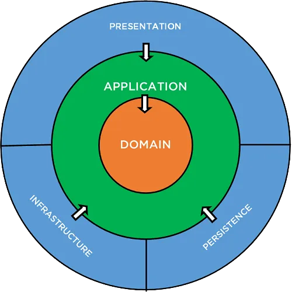

# Clean Architecture & Design Patterns en .NET Core

Ce document présente les principes de conception de la Clean Architecture appliqués aux applications .NET Core modernes, l'organisation des couches, ainsi que la mise en œuvre des patterns CQRS, Mediator, Repository et Unit of Work.

---

## 1. Principes Fondamentaux de la Clean Architecture

La Clean Architecture (popularisée par Robert C. Martin / Uncle Bob) vise à isoler la logique métier au cœur du système, la rendant totalement indépendante des frameworks, des bases de données, des interfaces utilisateur et des agents externes.



### Les Règle de Dépendance (Dependency Rule)
La règle absolue de la Clean Architecture est que **les dépendances du code pointe uniquement vers l'intérieur** :
* **Domain** ne dépend de RIEN.
* **Application** dépend uniquement de Domain.
* **Infrastructure** dépend de Application et de Domain.
* **Presentation (Web API)** dépend de Application et de Infrastructure (uniquement pour l'injection de dépendances).

---

## 2. Découpage et Rôle des Couches

### 1. Couche Domaine (`Domain`)
* **Contenu :** Entités métier, Value Objects, Enums, Exceptions Domaine, Événements Domaine (`Domain Events`), et Interfaces de domaines.
* **Règle :** Aucun composant externe ou dépendance à un framework (pas d'EF Core, pas de packages NuGet tiers si possible).

### 2. Couche Application (`Application`)
* **Contenu :** Cas d'utilisation (`Use Cases`), Commands/Queries (CQRS), DTOs, interfaces de services (ex: `IEmailService`, `IApplicationDbContext`), validations (`FluentValidation`), et Mappers.
* **Règle :** Contient la logique applicative orchestrant les entités du Domaine.

### 3. Couche Infrastructure (`Infrastructure`)
* **Contenu :** Persistance de données (EF Core `DbContext`, configurations d'entités, migrations), intégrations d'APIs externes, services de fichiers, envoi de mails, gestion de jetons JWT.
* **Règle :** Implémente les interfaces définies dans les couches `Application` et `Domain`.

### 4. Couche Présentation (`WebAPI`)
* **Contenu :** Controllers API, Middlewares (ex: gestion globale des exceptions), configurations OpenAPI/Swagger, et fichier `Program.cs` pour l'injection de dépendances (`Dependency Injection`).
* **Règle :** Point d'entrée HTTP. Reçoit les DTOs de requête, les transmet à la couche Application via MediatR, et retourne les DTOs de réponse.

---

## 3. Pattern CQRS (Command Query Responsibility Segregation) avec MediatR

Le pattern CQRS sépare les opérations de lecture (`Queries`) des opérations d'écriture (`Commands`).

* **Commands :** Modifient l'état du système (Créer, Modifier, Supprimer). Elles ne doivent pas retourner d'entités complètes, mais un identifiant ou un résultat d'exécution (`Result`).
* **Queries :** Lisent l'état du système sans le modifier. Elles retournent des DTOs optimisés pour l'affichage.

### Implémentation d'une Command (Création de ressource)

#### 1. La Command & DTO (`Application/Orders/Commands/CreateOrderCommand.cs`)
```csharp
using MediatR;

namespace Application.Orders.Commands;

// Commande de création retournant un Guid
public record CreateOrderCommand(
    Guid CustomerId,
    List<OrderItemDto> Items
) : IRequest<Guid>;

public record OrderItemDto(Guid ProductId, int Quantity, decimal UnitPrice);
